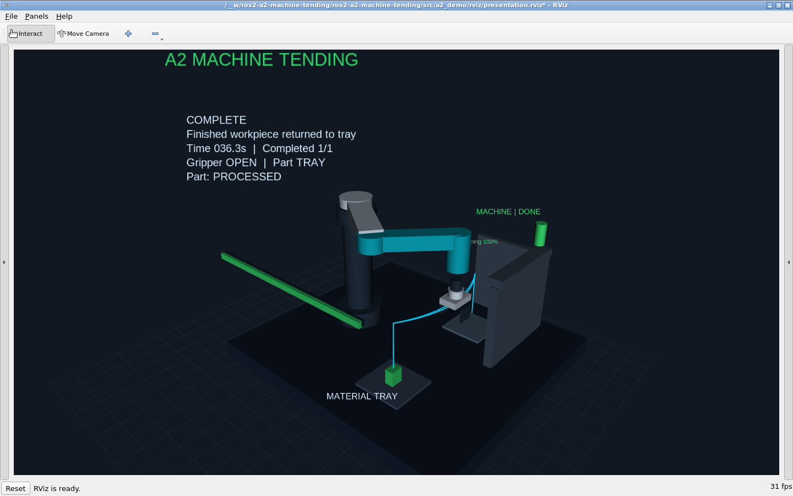

# A2 模拟机床上下料 · ROS 2 课程项目

面向 **Ubuntu 22.04 + ROS 2 Humble** 的机械臂上下料演示：从料盘抓取一个毛坯，放入模拟加工工位，机械臂退出加工区域，等待加工完成，取回成品并放回料盘，最后回到初始姿态。

**已交付源码、实际运行记录和 2 分 8 秒完整视频。** [视频与七张真实截图](deliverables/README.md) 已放入仓库。Ubuntu 云端的构建、20 项测试及五场景 ROS 验收均已通过：[验收记录](https://github.com/zcl1105/ros2-a2-machine-tending/actions/runs/37568023627)。最终 PPTX 尚未生成，八页内容草案与分工说明已准备。



这是 **ROS 2 + RViz 的运动学仿真**。自定义四自由度 SCARA 模型通过逆运动学和关节插值运动；加工、夹持和工件附着由可检查的状态模型表示。**不包含 Gazebo 接触力学、真实切削、MoveIt 碰撞规划或真机驱动**。截图中 MoveIt 是参考示例，不是该课程最低技术要求中明确指定的组件。如果教师另外要求 Gazebo / MoveIt / 指定机械臂，需要在此基础上扩展执行后端。

## 已实现的项目内容

- 四个应用节点：机械臂动作执行、工位信号模拟、任务调度与记录、场景可视化；另外使用 `robot_state_publisher` 和 RViz。
- 自定义 Action、Service 和 Message；动作执行有成功结果、进度反馈与取消接口。
- 21 个任务阶段；抓取、放置、加工完成都在验证状态后推进。
- 加工启动互锁：工位可用、工件已放入、夹爪打开、机械臂已退出工位。
- 工件跟随机械臂，夹爪开合，毛坯橙色 / 成品绿色，末端轨迹、状态面板、工位信号灯和加工进度。
- 工位占用等待、加工超时、通信心跳检查、任务取消、重复启动拒绝和仿真复位。
- 每次任务保存 CSV 阶段记录与 JSON 结果；提供 rosbag 录制脚本。
- 核心单元测试、五种 ROS 集成验收场景和 GitHub Actions 配置。

## Ubuntu 上启动

先按 [ROS 2 Humble 官方安装说明](https://docs.ros.org/en/humble/Installation/Ubuntu-Install-Debs.html) 配置 ROS 软件源并安装 Humble。官方 Humble 安装文档明确对应 Ubuntu 22.04；遇到页面访问限制可查看 [官方文档源码](https://github.com/ros2/ros2_documentation/blob/humble/source/Installation/Ubuntu-Install-Debs.rst)。已安装 ROS 后执行：

```bash
sudo apt update
sudo apt install -y git python3-colcon-common-extensions \
  ros-humble-rviz2 ros-humble-robot-state-publisher

# 私有仓库，先在当前电脑完成 GitHub 认证。
git clone https://github.com/zcl1105/ros2-a2-machine-tending.git a2_ws
cd a2_ws
bash scripts/build.sh
source install/setup.bash
ros2 launch a2_demo demo.launch.py
```

如果先使用本地项目，把整个目录复制到 Ubuntu，例如 `~/a2_ws`，进入该目录从 `bash scripts/build.sh` 开始即可。**这是 Linux 项目，不能直接在原生 Windows 中启动 ROS 节点。**

另开一个 Ubuntu 终端：

```bash
cd ~/a2_ws                  # 替换为实际克隆位置
source /opt/ros/humble/setup.bash
source install/setup.bash
ros2 service call /a2/task/start std_srvs/srv/Trigger '{}'
```

启动服务返回的是“已接受任务”。最终是否成功，以 `/a2/task/status` 中的 `phase: COMPLETE`、`success: true`、`completed: 1` 和 `results/*.json` 为准。

```bash
ros2 topic echo /a2/task/status
ros2 service call /a2/task/cancel std_srvs/srv/Trigger '{}'
ros2 service call /a2/task/reset std_srvs/srv/Trigger '{}'
```

复位也采用异步响应：等待状态恢复 `IDLE` 后再启动下一次任务。运行中禁止复位；取消后等待机械臂和未完成请求停止。复位会恢复仿真场景、毛坯位置和机械臂初始姿态，不表示真机安全复位。

## 连续完整流程


默认一次运行约半分钟，具体时长取决于回调调度。录屏时可以用以下参数降低运动速度：

```bash
ros2 launch a2_demo demo.launch.py motion_seconds:=1.8 process_seconds:=7.0
```

## 异常与条件变化

每种场景先关闭前一次 launch，然后重新启动；用另一个终端调用启动服务。

```bash
# 条件变化：工位最初占用 8 秒，任务等待后继续。
ros2 launch a2_demo demo.launch.py busy_seconds:=8.0

# 异常：工位一直不报告加工完成，10 秒后任务报超时。
ros2 launch a2_demo demo.launch.py stall:=true process_timeout:=10.0

# 异常：工位一直占用，6 秒后等待超时。
ros2 launch a2_demo demo.launch.py busy_seconds:=30.0 station_timeout:=6.0
```

工位占用从 `machine_sim` 启动 / 复位时计时。若先打开 RViz 再慢慢操作，占用时间可能已结束。录制条件变化时，可以先用服务注入占用，启动任务后再解除：

```bash
ros2 service call /a2/machine/command a2_interfaces/srv/MachineCommand "{command: BUSY_ON}"
ros2 service call /a2/task/start std_srvs/srv/Trigger '{}'
# 等待约 5 秒，保持在 station_timeout 内，再执行：
ros2 service call /a2/machine/command a2_interfaces/srv/MachineCommand "{command: BUSY_OFF}"
```

详见 [视频脚本](docs/视频录制脚本.md) 和 [验收说明](docs/验收与调试.md)。

## 测试和记录

```bash
python3 -m unittest discover -s tests -v   # 核心测试，无需 ROS 环境
bash scripts/integration.sh              # 已构建后运行，五种真实 ROS 通信场景
bash scripts/record_bag.sh               # 另一个终端中录制数据
```

集成验收使用独立 `ROS_DOMAIN_ID`，不会操作默认域中正在录屏的演示。运行日志位于 `results/integration/`。rosbag 是数据证据，**不能替代要求提交的屏幕演示视频**。

## 交付文档

| 文件 | 内容 |
| --- | --- |
| [架构与接口](docs/架构与接口.md) | 节点关系、接口字段、阶段、参数和开发边界 |
| [视频录制脚本](docs/视频录制脚本.md) | 2–3 分钟录屏分镜、完整流程、异常、字幕和证据 |
| [自动生成演示视频](docs/自动生成演示视频.md) | Ubuntu / GitHub 中运行真实 RViz 并输出 MP4、截图和记录 |
| [视频成品与真实截图](deliverables/README.md) | 已生成的 128.65 秒 MP4、七张截图及对应运行记录 |
| [验收与调试](docs/验收与调试.md) | Ubuntu 检查、集成场景、排错和结果判断 |
| [汇报与分工](docs/汇报与分工.md) | 8 页 PPT 内容草案、五人分工与四周计划 |
| [GitHub 与另一台电脑](docs/GitHub与跨电脑调试.md) | 发布、克隆、更新、隐私与日志分享 |
| [验证状态](docs/验证状态.md) | 已执行检查与尚未验证的项目 |

原创内容为本仓库的 SCARA 几何模型、任务状态机、互锁、异常处理、工位模型、可视化和验收脚本；ROS 2、RViz、`robot_state_publisher` 是复用组件。接口用法参考 [ROS 2 官方 Action 示例](https://github.com/ros2/examples/tree/humble/rclpy/actions)。作者与小组成员请在最终汇报前填写真实姓名，不把参考组件当作自行开发成果。
