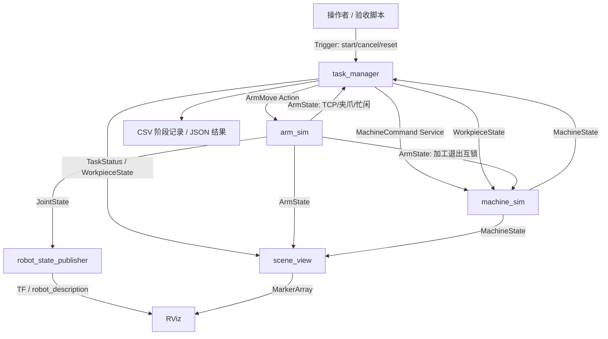

# 系统架构与接口

## 工业任务与判断标准

输入：启动任务、料盘中的一个毛坯、加工工位状态。机器人：取料、上料、退出工位、等待加工、下料、回料盘、归位。成功判断：`COMPLETE`、`completed=1`、工件在 `TRAY` 且 `processed=true`、夹爪打开、末端回到 `HOME`，保存 CSV 与 JSON。

本项目把“加工完成信号”作为工位输入，不做相机识别。A2 对应截图中的任务状态切换、工位信号、机械臂与夹爪控制；相机不属于当前基础任务的必要模块。



## 节点职责

| 节点 | 核心职责 | 可独立展示的结果 |
| --- | --- | --- |
| `arm_sim` | TCP 逆解、平滑关节插值、夹爪状态、动作取消、单目标互斥 | Action 目标达到、反馈、关节运动 |
| `machine_sim` | READY/BUSY/PROCESSING/DONE/FAULT，互锁和故障注入 | 工位占用信号、加工进度、完成信号 |
| `task_manager` | 任务编排、结果确认、超时、心跳、复位、结果持久化 | 正常闭环与异常运行记录 |
| `scene_view` | 工位、料盘、工件、灯、轨迹、HUD | 可录屏的场景与状态 |
| `robot_state_publisher` | 由 URDF 与关节状态计算 TF | 机器人姿态展示；复用官方组件 |

## ROS 接口

| 名称 | 类型 | 用途 |
| --- | --- | --- |
| `/a2/arm/move` | `a2_interfaces/action/ArmMove` | 目标 TCP、夹爪命令、持续时间；成功结果与进度反馈 |
| `/a2/arm/state` | `a2_interfaces/msg/ArmState` | TCP、夹爪闭合、机械臂是否忙 |
| `/a2/arm/reset` | `std_srvs/srv/Trigger` | 空闲时恢复仿真机械臂初始状态 |
| `/a2/machine/command` | `a2_interfaces/srv/MachineCommand` | START/ABORT/RESET/BUSY_ON/BUSY_OFF/FAULT_ON/FAULT_OFF |
| `/a2/machine/state` | `a2_interfaces/msg/MachineState` | 状态、加工进度、耗时、工件在位 |
| `/a2/task/start` | `std_srvs/srv/Trigger` | 非阻塞接受一轮任务 |
| `/a2/task/cancel` | `std_srvs/srv/Trigger` | 取消动作、停止加工、记录取消结果 |
| `/a2/task/reset` | `std_srvs/srv/Trigger` | 非运行时请求恢复初始仿真状态 |
| `/a2/task/status` | `a2_interfaces/msg/TaskStatus` | run_id、阶段、进度、完成数、成功标记、异常 |
| `/a2/workpiece` | `a2_interfaces/msg/WorkpieceState` | 工件在 TRAY/GRIPPER/MACHINE、是否加工完成 |
| `/a2/scene` | `visualization_msgs/msg/MarkerArray` | 场景、状态文字、轨迹与灯 |
| `/joint_states` | `sensor_msgs/msg/JointState` | 四自由度机械臂与两个夹爪指关节 |

`ArmMove.gripper`：`-1` 保持、`0` 打开、`1` 闭合。坐标均为 `world` 下的米。动作持续时间为 0.1–30 秒。运动为关节空间三次平滑插值，**TCP 不保证直线**。搬运阶段先抬升再转移；测试检查所有横向转移保持安全高度，但这不等于全机器人扫掠碰撞检测。

## 模型与阶段

SCARA 两段臂长 0.36 m 和 0.30 m，两个转动关节、一个向下的直线关节、一个姿态补偿腕关节。末端保持固定平面方向。料盘抓取点 `(0.42, -0.25, 0.37)`，工位抓取点 `(0.42, 0.25, 0.37)`，转移高度 `0.56`，HOME 为 `(0.50, 0.0, 0.56)`。工件中心比抓取点低 0.035 m。

完整阶段依次为：

```text
WAIT_READY
APPROACH_TRAY -> PICK_DESCEND -> PICK_GRIP -> PICK_LIFT
TRANSFER_LOAD -> LOAD_DESCEND -> LOAD_RELEASE -> LOAD_RETREAT
CLEAR_MACHINE -> START_MACHINE -> WAIT_PROCESS
APPROACH_MACHINE -> UNLOAD_DESCEND -> UNLOAD_GRIP -> UNLOAD_LIFT
TRANSFER_RETURN -> RETURN_DESCEND -> RETURN_RELEASE -> RETURN_LIFT
RETURN_HOME -> COMPLETE
```

抓取/放置阶段须验证 Action 成功、状态话题中的末端达到目标与夹爪状态；工件位置转移还要检查抓取点距离和工件原位置。加工完成阶段须接收到 `DONE` 且工件仍在位。异常以 `FAILED` 或 `CANCELED` 结束；禁止当作完成计数。

## 启动参数

| 参数 | 默认 | 说明 |
| --- | --- | --- |
| `rviz` | true | 是否打开 RViz；集成验收设 false |
| `motion_seconds` | 1.4 | 单个移动阶段持续时间；抓取/释放指令为 0.5 秒 |
| `process_seconds` | 5.0 | 模拟加工时长 |
| `busy_seconds` | 0.0 | 工位启动/复位后的初始占用时长 |
| `stall` | false | 加工永不完成，用于超时演示 |
| `station_timeout` | 12.0 | 初始工位等待上限 |
| `process_timeout` | 12.0 | 加工完成等待上限 |
| `output_dir` | 当前目录/results | CSV 与 JSON 位置 |

正常配置应满足 `process_timeout > process_seconds`。计时采用单调时钟，表示该仿真的实际经过时间，不采用 Gazebo `/clock`。暂停 RViz 画面不会暂停机器人任务。

## 开发边界

接口采用独立 `a2_interfaces` 包，未来可替换 `arm_sim` 为 MoveIt / ros2_control 执行后端，保留任务逻辑；但必须补齐执行器异常映射、目标坐标与实际反馈的约定。这里的在位与夹持是模型判断，不代表真实力传感器、接触检测或安全 PLC。相机识别、Gazebo 动力学、真实加工机床控制属于扩展内容。
